阿里[心流 AI](https://iflow.cn/) 团队的 iFLOW CLI 已经发布了一段时间了, 它是一个基于终端的强大智能体 Agent.目前通过它可以免费的使用到中国开发者研发的顶级大模型, 比如 Qwen3-Coder、Kimi K2 等。

这篇文章给出了很多的实战例子 -> [《能自动编码 + 调试？iFlow CLI 实战亲测！》](https://blog.csdn.net/iFlow_AI/article/details/150391659?spm=1001.2014.3001.5501),我们可以使用 iFLOW CLI 实现 RAG 系统、生成旅游规划等等。

据说对标 Claude Code 的 SubAgents 能力会在下一个版本发布, 还提供了基于 Qwen VL 视觉大模型的多模态处理能力, 并且在并行任务执行上有专门的优化。IDE 插件也即将发布了~

不知道你有没有在 GitHub 上使用过 [Claude Code Action](https://github.com/anthropics/claude-code-action),我们可以使用它快速的处理 GitHub 仓库的 issues, 让它根据某个 issue 自动编码并创建 pull requests.我们只需要在 issue 评论中 `@claude` 即可触发自动编码任务的执行。

iFLOW CLI 现在也有类似的工具了 -> [iflow-cli-action](https://github.com/vibe-ideas/iflow-cli-action), 感谢 claude-code-action 和 [Gemini CLI Action](https://github.com/google-github-actions/run-gemini-cli) 的工作, iflow-cli-action 的实现借鉴了它们的设计。

接下来我们看看如何利用 iflow-cli-action 在 GitHub 利用中国开发者研发的顶级大模型 Qwen3-Code 与 Kimi K2 快速提升你的生产力。

## 快速使用 iflow-cli-action

iflow-cli-action 对 iFLOW CLI 进行了封装, 基于 GitHub Actions 提供的强大自动化任务编排能力, 我们只需要在 GitHub 代码仓库创建对应的工作流文件, 即可快速使用上 iFLOW CLI 进行自动编码和问题 (issues) 处理。

> 如果你还不熟悉 GitHub Actions, 那么我推荐你快速阅读下 GitHub 官方的快速上手指南 [GitHub Actions 快速入门 - 几分钟内体验 GitHub Actions 的核心功能。](https://docs.github.com/zh/actions/get-started/quickstart)

在这里, 我们直接给出一个示例的工作流编排文件, 它会使用 iflow-cli-action 去创建一个 PPT 幻灯片风格的文档网站, 并发布出来, 如下：


```yaml
name: Build and Deploy Homepage

on:
  # Run every day at 02:00 UTC
  schedule:
    - cron: '0 2 * * *'
  # Allow manual trigger
  workflow_dispatch:
  # Also run on pushes to main branch
  push:
    branches:
    paths:
      - 'README.md'
      - 'README_zh.md'

# Sets permissions of the GITHUB_TOKEN to allow deployment to GitHub Pages
permissions:
  contents: read
  pages: write

# Allow only one concurrent deployment, skipping runs queued between the run in-progress and latest queued.
concurrency:
  group: "pages"
  cancel-in-progress: false

jobs:
  build:
    runs-on: ubuntu-latest
    env:
      GITHUB_PAGES: true
    steps:
      - name: Checkout repository
        uses: actions/checkout@v4

      - name: Setup Pages
        uses: actions/configure-pages@v4

      - name: Create homepage directory
        run: mkdir -p _site

      - name: Generate homepage using iFlow CLI
        uses: vibe-ideas/iflow-cli-action@main
        with:
          prompt: |
            请仅读取当前仓库的 README.md 文件内容（不要读取其他任何文件）,将其转换为一个基于 Reveal.js 的精美幻灯片风格文档网站并保存为 _site/index.html.
            
            要求：
            
            1. 使用 Reveal.js 框架构建幻灯片展示,将 README 内容按逻辑结构拆分为多个幻灯片页面；
            
            2. 幻灯片结构设计：
               - 首页幻灯片：项目标题、副标题、GitHub 链接和项目简介
               - 功能特性幻灯片：突出展示主要功能和特点
               - 安装指南幻灯片：分步骤展示安装过程
               - 使用示例幻灯片：展示代码示例和配置说明
               - 高级功能幻灯片：展示进阶用法和最佳实践
               - 结尾幻灯片：致谢、贡献指南和联系方式；
            
            3. 使用现代化的 Reveal.js 主题和配置：
               - 启用水平和垂直导航
               - 配置幻灯片过渡动画效果（如 slide、fade、zoom）
               - 添加进度条和幻灯片计数器
               - 支持键盘导航和触摸手势
               - 启用自动播放功能（可暂停）
               - 添加幻灯片缩略图概览；
            
            4. 视觉设计采用超现实主义数字拼贴风格：
               - 使用鲜明的色彩对比和几何图形元素
               - 创建层次丰富的视觉效果,结合文本和图形元素
               - 运用不规则形状、透明度和重叠效果创造深度感
               - 采用动态背景和动画过渡增强视觉冲击力
               - 使用抽象图形和数字元素作为装饰元素
               - 确保整体设计具有艺术感和视觉吸引力；
            
            5. 字体大小和布局优化（重要）：
               - 标题字体大小：主标题使用 2.5em,副标题使用 1.8em,节标题使用 1.5em
               - 正文字体大小：使用 1.2em,确保在所有设备上清晰可读
               - 代码字体大小：使用 0.9em,避免代码块过大导致布局问题
               - 行高设置：正文使用 1.6 倍行高,标题使用 1.4 倍行高
               - 内容区域边距：为每张幻灯片设置合适的 padding（上下 60px,左右 40px）
               - 确保文字与背景有足够间距,避免遮挡和重叠
               - 限制每张幻灯片的内容量,避免信息过载
               - 为长代码块实现垂直滚动,而不是缩小字体；
               - 增加字体族设置：使用系统默认字体族,确保在各种设备上都有良好显示效果
               - 为不同屏幕尺寸设置自适应字体大小,确保移动端阅读体验
               - 使用相对单位（em, rem）而非绝对单位（px）以适应用户缩放设置
               - 添加文字阴影或背景色块以增强文字可读性,特别是在复杂背景上
               - 严格控制每行字符数,避免过长行导致的阅读困难；
            
            6. 代码展示优化：
               - 使用 Reveal.js 的代码高亮插件
               - 支持语法高亮（YAML、Bash、Markdown 等）
               - 添加行号和复制按钮
               - 代码块使用合适的最大高度（60vh）和滚动条
               - 实现代码片段的动画展示效果；
            
            7. 交互功能：
               - 添加导航菜单和章节跳转
               - 实现全屏模式和演讲者模式
               - 支持 ESC 键显示幻灯片概览
               - 添加分享和导出功能；
            
            8. 响应式设计：
               - 确保在桌面、平板和移动设备上的良好体验
               - 移动设备上适当减小字体大小但保持可读性
               - 适配不同屏幕尺寸的字体和布局
               - 优化触摸设备的交互体验；
               - 为小屏幕设备设置特殊样式,确保文字不被截断或重叠
               - 使用媒体查询优化不同分辨率下的显示效果；
            
            9. 技术实现：
                - 从 CDN 引入最新版本的 Reveal.js
                - 配置必要的插件（highlight.js、notes、zoom 等）
                - 添加自定义 CSS 样式增强视觉效果
                - 确保快速加载和流畅的动画性能；
                - 使用 CSS 的 word-wrap、word-break 属性处理长单词和 URL 换行
                - 设置合理的 z-index 层级,确保文字始终在装饰元素之上；
            
            10. SEO 和可访问性：
                - 添加完整的 meta 标签和结构化数据
                - 确保键盘导航的可访问性
                - 添加 alt 文本和 aria 标签
                - 优化搜索引擎索引.
            
            请直接创建完整的 HTML 文件,使用内联 CSS 和 JavaScript,确保文件自包含且可以直接在浏览器中运行.
            
            项目地址为：https://github.com/vibe-ideas/iflow-cli-action
          api_key: ${{ secrets.IFLOW_API_KEY }}
          # settings_json: ${{ secrets.IFLOW_SETTINGS_JSON }}
          model: "Qwen3-Coder"
          timeout: "1800"
          extra_args: "--debug"

      - name: Verify reveal.js presentation was generated
        run: |
          if [ -f "_site/index.html" ]; then
            echo "Reveal.js presentation generated successfully!"
            echo "Checking for reveal.js content..."
            if grep -q "reveal.js" "_site/index.html"; then
              echo "✓ Reveal.js framework detected"
            else
              echo "⚠ Warning: Reveal.js framework not found in generated file"
            fi
            ls -la _site/
          else
            echo "Error: Presentation was not generated by iFlow"
            exit 1
          fi

      - name: Upload artifact
        uses: actions/upload-pages-artifact@v3
        with:
          path: ./_site

  deploy:
    environment:
      name: github-pages
      url: ${{ steps.deployment.outputs.page_url }}
    runs-on: ubuntu-latest
    needs: build
    steps:
      - name: Deploy to GitHub Pages
        id: deployment
        uses: actions/deploy-pages@v4
```


这个工作流的执行机制如下：

```mermaid
sequenceDiagram
    participant User as 用户
    participant GH as GitHub
    participant Runner1 as Ubuntu Runner (build)
    participant Runner2 as Ubuntu Runner (deploy)
    participant iFlow as iFlow CLI Action
    participant Pages as GitHub Pages

    Note over GH: 触发条件检查
    alt 定时触发 (每日 02:00 UTC)
        GH->>GH: 检查 cron 表达式
    else 手动触发
        User->>GH: workflow_dispatch
    else 推送到 main 分支
        User->>GH: 推送代码 (README.md/README_zh.md)
        GH->>GH: 检查文件路径匹配
    end

    Note over GH: 权限和并发控制
    GH->>GH: 设置 GITHUB_TOKEN 权限<br/>(contents: read, pages: write)
    GH->>GH: 检查并发组 "pages"<br/>(取消进行中的运行)

    Note over GH,Runner1: Build Job 开始
    GH->>Runner1: 分配 ubuntu-latest 运行器
    Runner1->>Runner1: 设置环境变量<br/>GITHUB_PAGES=true

    Note over Runner1: Step 1: 检出代码
    Runner1->>GH: actions/checkout@v4
    GH-->>Runner1: 返回仓库代码

    Note over Runner1: Step 2: 配置 Pages
    Runner1->>Runner1: actions/configure-pages@v4
    Runner1->>Runner1: 配置 GitHub Pages 设置

    Note over Runner1: Step 3: 创建目录
    Runner1->>Runner1: mkdir -p _site

    Note over Runner1: Step 4: 生成首页
    Runner1->>iFlow: vibe-ideas/iflow-cli-action@main
    Note over iFlow: 处理提示词
    iFlow->>iFlow: 读取 README.md
    iFlow->>iFlow: 使用 Qwen3-Coder 模型
    iFlow->>iFlow: 生成 Reveal.js 幻灯片
    iFlow-->>Runner1: 生成 _site/index.html

    Note over Runner1: Step 5: 验证生成结果
    Runner1->>Runner1: 检查 _site/index.html 是否存在
    Runner1->>Runner1: 验证 reveal.js 内容
    Runner1->>Runner1: 列出 _site/ 目录内容

    Note over Runner1: Step 6: 上传构建产物
    Runner1->>GH: actions/upload-pages-artifact@v3
    Runner1->>GH: 上传 _site/ 目录
    GH-->>Runner1: 确认上传成功

    Note over GH: Build Job 完成

    Note over GH,Runner2: Deploy Job 开始 (依赖 build)
    GH->>Runner2: 分配 ubuntu-latest 运行器
    Runner2->>Runner2: 设置 github-pages 环境

    Note over Runner2: Step 1: 部署到 GitHub Pages
    Runner2->>GH: actions/deploy-pages@v4
    GH->>Pages: 部署页面内容
    Pages-->>GH: 返回部署 URL
    GH-->>Runner2: 设置输出变量 page_url

    Note over GH: Deploy Job 完成

    Note over User,Pages: 工作流完成
    Pages->>User: 网站可访问<br/>(通过 GitHub Pages URL)
```



它会监听代码仓库的 push 事件, 查看 README.md 文件是否发生变化, 如果发生变化则让 iFLOW CLI 利用 Qwen3-COder 模型, 基于 Reveal.js 技术生成幻灯片, 并部署到 GitHub Pages.你可以通过这个网站直接查阅到对应的效果 [https://vibe-ideas.github.io/iflow-cli-action/#/](https://vibe-ideas.github.io/iflow-cli-action/#/).

自动化工作流使用到的 IFLOW_API_KEY 密钥需要到心流官方获取 [https://iflow.cn/?open=setting](https://iflow.cn/?open=setting).我们需要将密钥保存到 GitHub 仓库的 Secrets 中, 避免密钥泄露.Settings -> Secrets and variables -> Actions -> New repository secret, Secrets 名为 `IFLOW_API_KEY`:

你可以将上述工作流文件放到你的 GitHub 代码仓库的 `.github/workflows` 目录下, 提交并推送到 GitHub 仓库即可快速使用 & 执行。

> 使用时, 请确保你的代码仓库存在 README.md 文件。

更具体的使用方式, 可以参考我一周前发布的文章 [《使用 iFLOW-CLI GitHub Action 和 Qwen3-Coder 给 GitHub 仓库生成幻灯片风格的文档站点》](https://shan333.cn/2025/08/09/gen-slides-like-docs-site-with-iflow-cli/).

接下来我们将着重介绍如何使用 iflow-cli-action 让 iFLOW CLI 帮我们解决 GitHub 代码仓库 issues、对 pull request 进行代码评审。让 iFLOW CLI 变身为 issue 杀手。

## 让 iFLOW CLI 自动分类 GitHub issues

如果你是一个开源项目的开发者或者贡献者, 相信对于 GitHub issues 的分类打标签 (label) 并不陌生, 这里我们给出一个示例工作流, 它可以实现, 当有用户在代码仓库创建新的 issue 时, 会自动运行, 使用 iFLOW CLI 和 Qwen3-COder 模型分析 issue 内容, 然后给 issue 打上对应的分类标签, 方便开发者对 issues 进行管理, 如下：

```yaml
name: '🏷️ iFLOW CLI Automated Issue Triage'

on:
  issues:
    types:
      - 'opened'
      - 'reopened'
  issue_comment:
    types:
      - 'created'
  workflow_dispatch:
    inputs:
      issue_number:
        description: 'issue number to triage'
        required: true
        type: 'number'

concurrency:
  group: '${{ github.workflow }}-${{ github.event.issue.number }}'
  cancel-in-progress: true

defaults:
  run:
    shell: 'bash'

permissions:
  contents: 'read'
  issues: 'write'
  statuses: 'write'

jobs:
  triage-issue:
    if: |-
      github.event_name == 'issues' ||
      github.event_name == 'workflow_dispatch' ||
      (
        github.event_name == 'issue_comment' &&
        contains(github.event.comment.body, '@iflow-cli /triage') &&
        contains(fromJSON('["OWNER", "MEMBER", "COLLABORATOR"]'), github.event.comment.author_association)
      )
    timeout-minutes: 5
    runs-on: 'ubuntu-latest'
    steps:
      - name: Checkout repository
        uses: actions/checkout@v4

      - name: 'Run iFlow CLI Issue Triage'
        uses: vibe-ideas/iflow-cli-action@main
        id: 'iflow_cli_issue_triage'
        env:
          GITHUB_TOKEN: '${{ secrets.GITHUB_TOKEN }}'
          ISSUE_TITLE: '${{ github.event.issue.title }}'
          ISSUE_BODY: '${{ github.event.issue.body }}'
          ISSUE_NUMBER: '${{ github.event.issue.number }}'
          REPOSITORY: '${{ github.repository }}'
        with:
          api_key: ${{ secrets.IFLOW_API_KEY }}
          timeout: "3600"
          extra_args: "--debug"
          prompt: |
            ## Role

            You are an issue triage assistant. Analyze the current GitHub issue
            and apply the most appropriate existing labels. Use the available
            tools to gather information; do not ask for information to be
            provided.

            ## Steps

            1. Run: `gh label list` to get all available labels.
            2. Review the issue title and body provided in the environment
               variables: "${ISSUE_TITLE}" and "${ISSUE_BODY}".
            3. Classify issues by their kind (bug, enhancement, documentation,
               cleanup, etc) and their priority (p0, p1, p2, p3). Set the
               labels according to the format `kind/*` and `priority/*` patterns.
            4. Apply the selected labels to this issue using:
               `gh issue edit "${ISSUE_NUMBER}" --add-label "label1,label2"`
            5. If the "status/needs-triage" label is present, remove it using:
               `gh issue edit "${ISSUE_NUMBER}" --remove-label "status/needs-triage"`

            ## Guidelines

            - Only use labels that already exist in the repository
            - Do not add comments or modify the issue content
            - Triage only the current issue
            - Assign all applicable labels based on the issue content
            - Reference all shell variables as "${VAR}" (with quotes and braces)

      - name: 'Post Issue Triage Failure Comment'
        if: |-
          ${{ failure() && steps.iflow_cli_issue_triage.outcome == 'failure' }}
        uses: 'actions/github-script@60a0d83039c74a4aee543508d2ffcb1c3799cdea'
        with:
          github-token: '${{ secrets.GITHUB_TOKEN }}'
          script: |-
            github.rest.issues.createComment({
              owner: '${{ github.repository }}'.split('/')[0],
              repo: '${{ github.repository }}'.split('/')[1],
              issue_number: '${{ github.event.issue.number }}',
              body: 'There is a problem with the iFlow CLI issue triaging. Please check the [action logs](${{ github.server_url }}/${{ github.repository }}/actions/runs/${{ github.run_id }}) for details.'
            })
```

如果是一些存量的 issue, 可以直接在 issue 中评论 `@iflow-cli /triage` 触发自动分类。效果如下, 可以看到 issue 被 GitHub Actions 的 robot 机器人打上了标签 [https://github.com/vibe-ideas/iflow-cli-action/issues/14](https://github.com/vibe-ideas/iflow-cli-action/issues/14):


## 让 iFLOW CLI 成为 GitHub issues 杀手

前文介绍了 issue 的自动分类, 介绍来, 我会将会使用一个 GitHub issues 杀手, 让 iFLOW CLI 帮我们实现某个特性 feature issue 或者修复某个 bug issue。工作流定义如下:



```yaml
name: '🚀 iFlow CLI Issue Killer'

on:
  issue_comment:
    types:
      - 'created'
  workflow_dispatch:
    inputs:
      issue_number:
        description: 'issue number to implement'
        required: true
        type: 'number'

concurrency:
  group: '${{ github.workflow }}-${{ github.event.issue.number }}'
  cancel-in-progress: true

defaults:
  run:
    shell: 'bash'

permissions:
  contents: 'write'
  issues: 'write'
  pull-requests: 'write'

jobs:
  implement-issue:
    if: |-
      github.event_name == 'workflow_dispatch' ||
      (
        github.event_name == 'issue_comment' &&
        contains(github.event.comment.body, '@iflow-cli /issue-killer') &&
        contains(fromJSON('["OWNER", "MEMBER", "COLLABORATOR"]'), github.event.comment.author_association)
      )
    timeout-minutes: 30
    runs-on: 'ubuntu-latest'
    steps:
      - name: Checkout repository
        uses: actions/checkout@v4
        with:
          token: ${{ secrets.GITHUB_TOKEN }}

      - name: Get Issue Details
        id: get_issue
        uses: 'actions/github-script@60a0d83039c74a4aee543508d2ffcb1c3799cdea'
        with:
          github-token: ${{ secrets.GITHUB_TOKEN }}
          script: |
            const issue_number = process.env.INPUT_ISSUE_NUMBER || context.issue.number;
            core.setOutput('issue_number', issue_number);
            
            const issue = await github.rest.issues.get({
              owner: context.repo.owner,
              repo: context.repo.repo,
              issue_number: parseInt(issue_number)
            });
            
            core.setOutput('issue_title', issue.data.title);
            core.setOutput('issue_body', issue.data.body);
            
            // Parse implementation request from comment or use issue body
            let implementation_request = issue.data.body;
            if (context.eventName === 'issue_comment') {
              implementation_request = context.payload.comment.body.replace('@iflow-cli /issue-killer', '').trim();
              if (implementation_request === '') {
                implementation_request = issue.data.body;
              }
            }
            
            core.setOutput('implementation_request', implementation_request);

      - name: 'Run iFlow CLI Implementation'
        uses: vibe-ideas/iflow-cli-action@main
        id: 'iflow_cli_implementation'
        env:
          GITHUB_TOKEN: '${{ secrets.GITHUB_TOKEN }}'
          ISSUE_TITLE: '${{ steps.get_issue.outputs.issue_title }}'
          ISSUE_BODY: '${{ steps.get_issue.outputs.issue_body }}'
          ISSUE_NUMBER: '${{ steps.get_issue.outputs.issue_number }}'
          REPOSITORY: '${{ github.repository }}'
        with:
          api_key: ${{ secrets.IFLOW_API_KEY }}
          timeout: "1800"
          extra_args: "--debug"
          settings_json: |
            {
                "selectedAuthType": "iflow",
                "apiKey": "${{ secrets.IFLOW_API_KEY }}",
                "baseUrl": "https://apis.iflow.cn/v1",
                "modelName": "Qwen3-Coder",
                "searchApiKey": "${{ secrets.IFLOW_API_KEY }}",
                "mcpServers": {
                  "github": {
                  "command": "github-mcp-server",
                  "args": [
                    "stdio"
                  ],
                  "includeTools": [
                    "create_pull_request",
                    "list_pull_requests",
                    "add_issue_comment"
                  ],
                    "env": {
                      "GITHUB_PERSONAL_ACCESS_TOKEN": "${{ secrets.GITHUB_TOKEN }}"
                    }
                  }
                }
            }
          prompt: |
            ## Role

            You are an implementation assistant. Your task is to implement a feature
            based on the GitHub issue provided. Follow these steps:

            1. **FIRST**: Create a start comment on the issue using the GitHub MCP tool
            2. Analyze the issue title and body provided in the environment
               variables: "${ISSUE_TITLE}" and "${ISSUE_BODY}".
            3. If the comment that triggered this action contains additional
               implementation instructions, use those as well.
            4. Implement the requested feature by creating or modifying files as
               needed.
            5. Ensure all changes are complete and correct according to the issue
               requirements.
            6. Do not add comments or modify the issue content beyond the required start and completion comments.
            7. Focus only on implementing the current issue.

            ## Creating Start Comment

            Before starting the implementation, create a start comment on the issue using the GitHub MCP tool:
            1. Use the add_issue_comment to add a comment to issue #${ISSUE_NUMBER}
            2. The start comment should include:
               - 🚀 Notification that the implementation task has started
               - 🤖 Mention that iFlow CLI Issue Killer is processing the issue
               - 📋 Current status: analyzing and implementing the feature
               - 📝 **Execution Plan**: Brief outline of the planned implementation steps based on the issue requirements
               - ⏱️ Expected time: usually takes a few minutes to ten minutes
               - 🔍 **View execution logs**: [GitHub Actions Run](${{ github.server_url }}/${{ github.repository }}/actions/runs/${{ github.run_id }})
               - 🤖 Note that this is an automated comment and there will be a completion notification
            3. For the execution plan, analyze the issue requirements and provide a clear, numbered list of implementation steps, such as:
               - Files to be created or modified
               - Key functionality to be implemented
               - Tests to be added or updated
               - Dependencies or configurations to be changed

            ## Guidelines

            - Make all necessary code changes to implement the feature
            - Ensure new code follows existing project conventions
            - Add or modify tests if applicable
            - Reference all shell variables as "${VAR}" (with quotes and braces)
            
            ## Creating Pull Request
            
            Once you have implemented the feature, create a pull request using the GitHub MCP tool:
            1. Use the create_pull_request to create a Pull Request.
            2. The PR should be created from a new branch with a descriptive name (e.g., feature/issue-${ISSUE_NUMBER}, fix/issue-${ISSUE_NUMBER}, or a descriptive name based on the feature)
            3. The PR title should be descriptive and reference the issue number
            4. The PR body should explain what was implemented and reference the issue
            5. Remember the branch name you create, as it will be needed for the completion comment if PR creation fails
            
            ## Creating Completion Comment
            
            After successfully implementing the feature and creating the PR, add a completion comment to the issue using the GitHub MCP tool:
            1. Use the add_issue_comment to add a comment to issue #${ISSUE_NUMBER}
            2. The comment should include:
               - ✅ Confirmation that the issue has been implemented
               - 🎉 Brief summary of what was accomplished
               - 📋 List of key changes made
               - 🔗 Link to the created Pull Request (if successful)
               - 📝 If PR creation failed, provide a manual PR creation link using the actual branch name you created, like: https://github.com/${{ github.repository }}/compare/main...[YOUR_BRANCH_NAME]
               - 🤖 Note that this is an automated implementation
            3. Use a friendly tone and include appropriate emojis for better user experience

      - name: 'Post Implementation Failure Comment'
        if: |-
          ${{ failure() && steps.iflow_cli_implementation.outcome == 'failure' }}
        uses: 'actions/github-script@60a0d83039c74a4aee543508d2ffcb1c3799cdea'
        with:
          github-token: '${{ secrets.GITHUB_TOKEN }}'
          script: |-
            github.rest.issues.createComment({
              owner: '${{ github.repository }}'.split('/')[0],
              repo: '${{ github.repository }}'.split('/')[1],
              issue_number: '${{ steps.get_issue.outputs.issue_number }}',
              body: 'There is a problem with the iFlow CLI issue implementation. Please check the [action logs](${{ github.server_url }}/${{ github.repository }}/actions/runs/${{ github.run_id }}) for details.'
            })
```



我将上述工作流的执行机制, 转化为了 mermaid 时序图, 供快速了解, 执行机制大概是这样的：我们只需要在 issue 下评论 `@iflow-cli /issue-killer` 即可触发这个工作流。iFLOW CLI 会使用 [GitHub MCP Server](https://github.com/github/github-mcp-server) 和 [gh cli](https://github.com/cli/cli) 命令行工具自动分析 Issue 内容并生成执行计划, 生成代码, 生成完成后会提醒开发者工作已经完成。

```mermaid
sequenceDiagram
    participant User as 用户
    participant GitHub as GitHub
    participant iFlow as iFlow CLI
    participant MCP as GitHub MCP 工具

    User->>GitHub: 在 Issue 中评论 @iflow-cli /issue-killer
    GitHub->>iFlow: 触发工作流并传递 Issue 信息
    iFlow->>MCP: 调用 add_issue_comment 添加开始评论
    iFlow->>iFlow: 分析 Issue 内容并生成执行计划
    iFlow->>MCP: 使用 create_pull_request 创建 PR
    iFlow->>MCP: 调用 add_issue_comment 添加完成评论
    Note over iFlow,MCP: 若执行失败, 则添加失败评论
```



具体的效果可以查看这个 iflow-cli-action 代码仓库的这个 issue, 我让 iFLOW CLI 去自动的帮花优化 iflow-cli-action 使用的镜像体积:

[https://github.com/vibe-ideas/iflow-cli-action/issues/14](https://github.com/vibe-ideas/iflow-cli-action/issues/14)


可以看到 iFLOW CLI 会在执行前大概告知我们执行计划, 然后执行成功后, 会自动在 Issue 中评论引导我们创建 Pull Request.

## 让 iFLOW CLI 对 GitHub PR 进行评审

接下来我们再看一个常见的使用场景：代码评审, 话不多说, 我们直接上 GitHub Actions 自动化工作流定义, 工作流程如下：

```mermaid
sequenceDiagram
    participant User as 用户
    participant GitHub as GitHub
    participant iFlow as iFlow CLI
    participant MCP as GitHub MCP 工具

    User->>GitHub: PR 中评论 @iflow-cli /review
    GitHub->>iFlow: 触发 PR Review 工作流
    iFlow->>GitHub: 获取 PR 详细信息和变更文件列表
    iFlow->>iFlow: 分析 PR 变更内容与上下文
    iFlow->>MCP: 创建待处理的 PR 审查
    loop 逐文件审查
        iFlow->>MCP: 添加行内评论或代码建议(含严重性标识)
    end
    iFlow->>MCP: 提交 PR 审查并附上总结评论
    Note over iFlow,MCP: 若执行失败, 则添加失败评论到 PR
```



整体的实现机制与 issue-killer 大差不差, 只是替换了使用到的 MCP 工具. 直接在 PR 中评论 `@iflow-cli /review` 即可触发.

你可以在这个代码评审中看到实际效果: [https://github.com/vibe-ideas/iflow-cli-action/pull/15](https://github.com/vibe-ideas/iflow-cli-action/pull/15)



```yaml
name: '🧐 iFLOW CLI Pull Request Review'

on:
  pull_request:
    types:
      - 'opened'
      - 'reopened'
  issue_comment:
    types:
      - 'created'
  pull_request_review_comment:
    types:
      - 'created'
  pull_request_review:
    types:
      - 'submitted'
  workflow_dispatch:
    inputs:
      pr_number:
        description: 'PR number to review'
        required: true
        type: 'number'

concurrency:
  group: '${{ github.workflow }}-${{ github.head_ref || github.ref }}'
  cancel-in-progress: true

defaults:
  run:
    shell: 'bash'

permissions:
  contents: 'read'
  issues: 'write'
  pull-requests: 'write'
  statuses: 'write'

jobs:
  review-pr:
    # This condition seeks to ensure the action is only run when it is triggered by a trusted user.
    # For private repos, users who have access to the repo are considered trusted.
    # For public repos, users who members, owners, or collaborators are considered trusted.
    if: |-
      github.event_name == 'workflow_dispatch' ||
      (
        github.event_name == 'pull_request' &&
        (
          github.event.repository.private == true ||
          contains(fromJSON('["OWNER", "MEMBER", "COLLABORATOR"]'), github.event.pull_request.author_association)
        )
      ) ||
      (
        (
          (
            github.event_name == 'issue_comment' &&
            github.event.issue.pull_request
          ) ||
          github.event_name == 'pull_request_review_comment'
        ) &&
        (
          contains(github.event.comment.body, '@iflow-cli /review ') ||
          contains(github.event.comment.body, '@iFlow-CLI /review ') ||
          contains(github.event.comment.body, '@IFLOW-CLI /review ') ||
          contains(github.event.comment.body, '@IFlow-CLI /review ') ||
          endsWith(github.event.comment.body, '@iflow-cli /review') ||
          endsWith(github.event.comment.body, '@iFlow-CLI /review') ||
          endsWith(github.event.comment.body, '@IFLOW-CLI /review') ||
          endsWith(github.event.comment.body, '@IFlow-CLI /review')
        ) &&
        (
          github.event.repository.private == true ||
          contains(fromJSON('["OWNER", "MEMBER", "COLLABORATOR"]'), github.event.comment.author_association)
        )
      ) ||
      (
        github.event_name == 'pull_request_review' &&
        (
          contains(github.event.review.body, '@iflow-cli /review ') ||
          contains(github.event.review.body, '@iFlow-CLI /review ') ||
          contains(github.event.review.body, '@IFLOW-CLI /review ') ||
          contains(github.event.review.body, '@IFlow-CLI /review ') ||
          endsWith(github.event.review.body, '@iflow-cli /review') ||
          endsWith(github.event.review.body, '@iFlow-CLI /review') ||
          endsWith(github.event.review.body, '@IFLOW-CLI /review') ||
          endsWith(github.event.review.body, '@IFlow-CLI /review')
        ) &&
        (
          github.event.repository.private == true ||
          contains(fromJSON('["OWNER", "MEMBER", "COLLABORATOR"]'), github.event.review.author_association)
        )
      )
    timeout-minutes: 5
    runs-on: 'ubuntu-latest'
    steps:
      - name: 'Checkout PR code'
        uses: 'actions/checkout@11bd71901bbe5b1630ceea73d27597364c9af683' # ratchet:actions/checkout@v4

      - name: 'Get PR details (pull_request & workflow_dispatch)'
        id: 'get_pr'
        if: |-
          ${{ github.event_name == 'pull_request' || github.event_name == 'workflow_dispatch' }}
        env:
          GITHUB_TOKEN: '${{ secrets.GITHUB_TOKEN }}'
          EVENT_NAME: '${{ github.event_name }}'
          WORKFLOW_PR_NUMBER: '${{ github.event.inputs.pr_number }}'
          PULL_REQUEST_NUMBER: '${{ github.event.pull_request.number }}'
        run: |-
          set -euo pipefail

          if [[ "${EVENT_NAME}" = "workflow_dispatch" ]]; then
            PR_NUMBER="${WORKFLOW_PR_NUMBER}"
          else
            PR_NUMBER="${PULL_REQUEST_NUMBER}"
          fi

          echo "pr_number=${PR_NUMBER}" >> "${GITHUB_OUTPUT}"

          # Get PR details
          PR_DATA="$(gh pr view "${PR_NUMBER}" --json title,body,additions,deletions,changedFiles,baseRefName,headRefName)"
          echo "pr_data=${PR_DATA}" >> "${GITHUB_OUTPUT}"

          # Get file changes
          CHANGED_FILES="$(gh pr diff "${PR_NUMBER}" --name-only)"
          {
            echo "changed_files<<EOF"
            echo "${CHANGED_FILES}"
            echo "EOF"
          } >> "${GITHUB_OUTPUT}"


      - name: 'Get PR details (issue_comment & reviews)'
        id: 'get_pr_comment'
        if: |-
          ${{ github.event_name == 'issue_comment' || github.event_name == 'pull_request_review' || github.event_name == 'pull_request_review_comment' }}
        env:
          GITHUB_TOKEN: '${{ secrets.GITHUB_TOKEN }}'
          COMMENT_BODY: '${{ github.event.comment.body || github.event.review.body }}'
          PR_NUMBER: '${{ github.event.issue.number || github.event.pull_request.number }}'
        run: |-
          set -euo pipefail

          echo "pr_number=${PR_NUMBER}" >> "${GITHUB_OUTPUT}"

          # Extract additional instructions from comment (case insensitive, exact match for /review)
          ADDITIONAL_INSTRUCTIONS=""
          if echo "${COMMENT_BODY}" | grep -qiE '@iflow-cli[[:space:]]+/review([[:space:]]|$)'; then
            ADDITIONAL_INSTRUCTIONS="$(echo "${COMMENT_BODY}" | sed -E 's/.*@[iI][fF][lL][oO][wW]-[cC][lL][iI][[:space:]]+\/[rR][eE][vV][iI][eE][wW][[:space:]]*(.*)/\1/' | sed 's/^[[:space:]]*//;s/[[:space:]]*$//')"
          fi
          echo "additional_instructions=${ADDITIONAL_INSTRUCTIONS}" >> "${GITHUB_OUTPUT}"

          # Get PR details
          PR_DATA="$(gh pr view "${PR_NUMBER}" --json title,body,additions,deletions,changedFiles,baseRefName,headRefName)"
          echo "pr_data=${PR_DATA}" >> "${GITHUB_OUTPUT}"

          # Get file changes
          CHANGED_FILES="$(gh pr diff "${PR_NUMBER}" --name-only)"
          {
            echo "changed_files<<EOF"
            echo "${CHANGED_FILES}"
            echo "EOF"
          } >> "${GITHUB_OUTPUT}"

      - name: 'Run iFLOW CLI PR Review'
        uses: ./
        id: 'iflow_cli_pr_review'
        env:
          GITHUB_TOKEN: '${{ secrets.GITHUB_TOKEN }}'
          PR_NUMBER: '${{ steps.get_pr.outputs.pr_number || steps.get_pr_comment.outputs.pr_number }}'
          PR_DATA: '${{ steps.get_pr.outputs.pr_data || steps.get_pr_comment.outputs.pr_data }}'
          CHANGED_FILES: '${{ steps.get_pr.outputs.changed_files || steps.get_pr_comment.outputs.changed_files }}'
          ADDITIONAL_INSTRUCTIONS: '${{ steps.get_pr.outputs.additional_instructions || steps.get_pr_comment.outputs.additional_instructions }}'
          REPOSITORY: '${{ github.repository }}'
        with:
          api_key: ${{ secrets.IFLOW_API_KEY }}
          timeout: "3600"
          extra_args: "--debug"
          settings_json: |
            {
                "selectedAuthType": "iflow",
                "apiKey": "${{ secrets.IFLOW_API_KEY }}",
                "baseUrl": "https://apis.iflow.cn/v1",
                "modelName": "Qwen3-Coder",
                "searchApiKey": "${{ secrets.IFLOW_API_KEY }}",
                "mcpServers": {
                  "github": {
                  "command": "github-mcp-server",
                  "args": [
                    "stdio"
                  ],
                  "includeTools": [
                    "create_pending_pull_request_review",
                    "add_comment_to_pending_review",
                    "submit_pending_pull_request_review",
                    "list_pull_requests"
                  ],
                    "env": {
                      "GITHUB_PERSONAL_ACCESS_TOKEN": "${{ secrets.GITHUB_TOKEN }}"
                    }
                  }
                }
            }
          prompt: |
            ## Role

            You are an expert code reviewer. You have access to tools to gather
            PR information and perform the review on GitHub. Use the available tools to
            gather information; do not ask for information to be provided.

            ## Requirements
            1. All feedback must be left on GitHub.
            2. Any output that is not left in GitHub will not be seen.

            ## Steps

            Start by running these commands to gather the required data:
            1. Run: echo "${REPOSITORY}" to get the github repository in <OWNER>/<REPO> format
            2. Run: echo "${PR_DATA}" to get PR details (JSON format)
            3. Run: echo "${CHANGED_FILES}" to get the list of changed files
            4. Run: echo "${PR_NUMBER}" to get the PR number
            5. Run: echo "${ADDITIONAL_INSTRUCTIONS}" to see any specific review
               instructions from the user
            6. Run: gh pr diff "${PR_NUMBER}" to see the full diff and reference
            Context section to understand it
            7. For any specific files, use: cat filename, head -50 filename, or
               tail -50 filename
            8. If ADDITIONAL_INSTRUCTIONS contains text, prioritize those
               specific areas or focus points in your review. Common instruction
               examples: "focus on security", "check performance", "review error
               handling", "check for breaking changes"

            ## Guideline
            ### Core Guideline(Always applicable)

            1. Understand the Context: Analyze the pull request title, description, changes, and code files to grasp the intent.
            2. Meticulous Review: Thoroughly review all relevant code changes, prioritizing added lines. Consider the specified
              focus areas and any provided style guide.
            3. Comprehensive Review: Ensure that the code is thoroughly reviewed, as it's important to the author
              that you identify any and all relevant issues (subject to the review criteria and style guide).
              Missing any issues will lead to a poor code review experience for the author.
            4. Constructive Feedback:
              * Provide clear explanations for each concern.
              * Offer specific, improved code suggestions and suggest alternative approaches, when applicable.
                Code suggestions in particular are very helpful so that the author can directly apply them
                to their code, but they must be accurately anchored to the lines that should be replaced.
            5. Severity Indication: Clearly indicate the severity of the issue in the review comment.
              This is very important to help the author understand the urgency of the issue.
              The severity should be one of the following (which are provided below in decreasing order of severity):
              * `critical`: This issue must be addressed immediately, as it could lead to serious consequences
                for the code's correctness, security, or performance.
              * `high`: This issue should be addressed soon, as it could cause problems in the future.
              * `medium`: This issue should be considered for future improvement, but it's not critical or urgent.
              * `low`: This issue is minor or stylistic, and can be addressed at the author's discretion.
            6. Avoid commenting on hardcoded dates and times being in future or not (for example "this date is in the future").
              * Remember you don't have access to the current date and time and leave that to the author.
            7. Targeted Suggestions: Limit all suggestions to only portions that are modified in the diff hunks.
              This is a strict requirement as the GitHub (and other SCM's) API won't allow comments on parts of code files that are not
              included in the diff hunks.
            8. Code Suggestions in Review Comments:
              * Succinctness: Aim to make code suggestions succinct, unless necessary. Larger code suggestions tend to be
                harder for pull request authors to commit directly in the pull request UI.
              * Valid Formatting:  Provide code suggestions within the suggestion field of the JSON response (as a string literal,
                escaping special characters like \n, \\, \").  Do not include markdown code blocks in the suggestion field.
                Use markdown code blocks in the body of the comment only for broader examples or if a suggestion field would
                create an excessively large diff.  Prefer the suggestion field for specific, targeted code changes.
              * Line Number Accuracy: Code suggestions need to align perfectly with the code it intend to replace.
                Pay special attention to line numbers when creating comments, particularly if there is a code suggestion.
                Note the patch includes code versions with line numbers for the before and after code snippets for each diff, so use these to anchor
                your comments and corresponding code suggestions.
              * Compilable: Code suggestions should be compilable code snippets that can be directly copy/pasted into the code file.
                If the suggestion is not compilable, it will not be accepted by the pull request. Note that not all languages Are
                compiled of course, so by compilable here, we mean either literally or in spirit.
              * Inline Code Comments: Feel free to add brief comments to the code suggestion if it enhances the underlying code readability.
                Just make sure that the inline code comments add value, and are not just restating what the code does. Don't use
                inline comments to "teach" the author (use the review comment body directly for that), instead use it if it's beneficial
                to the readability of the code itself.
            10. Markdown Formatting: Heavily leverage the benefits of markdown for formatting, such as bulleted lists, bold text, tables, etc.
            11. Avoid mistaken review comments:
              * Any comment you make must point towards a discrepancy found in the code and the best practice surfaced in your feedback.
                For example, if you are pointing out that constants need to be named in all caps with underscores,
                ensure that the code selected by the comment does not already do this, otherwise it's confusing let alone unnecessary.
            12. Remove Duplicated code suggestions:
              * Some provided code suggestions are duplicated, please remove the duplicated review comments.
            13. Don't Approve The Pull Request
            14. Reference all shell variables as "${VAR}" (with quotes and braces)

            ### Review Criteria (Prioritized in Review)

            * Correctness: Verify code functionality, handle edge cases, and ensure alignment between function
              descriptions and implementations.  Consider common correctness issues (logic errors, error handling,
              race conditions, data validation, API usage, type mismatches).
            * Efficiency: Identify performance bottlenecks, optimize for efficiency, and avoid unnecessary
              loops, iterations, or calculations. Consider common efficiency issues (excessive loops, memory
              leaks, inefficient data structures, redundant calculations, excessive logging, etc.).
            * Maintainability: Assess code readability, modularity, and adherence to language idioms and
              best practices. Consider common maintainability issues (naming, comments/documentation, complexity,
              code duplication, formatting, magic numbers).  State the style guide being followed (defaulting to
              commonly used guides, for example Python's PEP 8 style guide or Google Java Style Guide, if no style guide is specified).
            * Security: Identify potential vulnerabilities (e.g., insecure storage, injection attacks,
              insufficient access controls).

            ### Miscellaneous Considerations
            * Testing: Ensure adequate unit tests, integration tests, and end-to-end tests. Evaluate
              coverage, edge case handling, and overall test quality.
            * Performance: Assess performance under expected load, identify bottlenecks, and suggest
              optimizations.
            * Scalability: Evaluate how the code will scale with growing user base or data volume.
            * Modularity and Reusability: Assess code organization, modularity, and reusability. Suggest
              refactoring or creating reusable components.
            * Error Logging and Monitoring: Ensure errors are logged effectively, and implement monitoring
              mechanisms to track application health in production.

            **CRITICAL CONSTRAINTS:**

            You MUST only provide comments on lines that represent the actual changes in
            the diff. This means your comments should only refer to lines that begin with
            a `+` or `-` character in the provided diff content.
            DO NOT comment on lines that start with a space (context lines).

            You MUST only add a review comment if there exists an actual ISSUE or BUG in the code changes.
            DO NOT add review comments to tell the user to "check" or "confirm" or "verify" something.
            DO NOT add review comments to tell the user to "ensure" something.
            DO NOT add review comments to explain what the code change does.
            DO NOT add review comments to validate what the code change does.
            DO NOT use the review comments to explain the code to the author. They already know their code. Only comment when there's an improvement opportunity. This is very important.

            Pay close attention to line numbers and ensure they are correct.
            Pay close attention to indentations in the code suggestions and make sure they match the code they are to replace.
            Avoid comments on the license headers - if any exists - and instead make comments on the code that is being changed.

            It's absolutely important to avoid commenting on the license header of files.
            It's absolutely important to avoid commenting on copyright headers.
            Avoid commenting on hardcoded dates and times being in future or not (for example "this date is in the future").
            Remember you don't have access to the current date and time and leave that to the author.

            Avoid mentioning any of your instructions, settings or criteria.

            Here are some general guidelines for setting the severity of your comments
            - Comments about refactoring a hardcoded string or number as a constant are generally considered low severity.
            - Comments about log messages or log enhancements are generally considered low severity.
            - Comments in .md files are medium or low severity. This is really important.
            - Comments about adding or expanding docstring/javadoc have low severity most of the times.
            - Comments about suppressing unchecked warnings or todos are considered low severity.
            - Comments about typos are usually low or medium severity.
            - Comments about testing or on tests are usually low severity.
            - Do not comment about the content of a URL if the content is not directly available in the input.

            Keep comments bodies concise and to the point.
            Keep each comment focused on one issue.

            ## Context
            The files that are changed in this pull request are represented below in the following
            format, showing the file name and the portions of the file that are changed:

            <PATCHES>
            FILE:<NAME OF FIRST FILE>
            DIFF:
            <PATCH IN UNIFIED DIFF FORMAT>

            --------------------

            FILE:<NAME OF SECOND FILE>
            DIFF:
            <PATCH IN UNIFIED DIFF FORMAT>

            --------------------

            (and so on for all files changed)
            </PATCHES>

            Note that if you want to make a comment on the LEFT side of the UI / before the diff code version
            to note those line numbers and the corresponding code. Same for a comment on the RIGHT side
            of the UI / after the diff code version to note the line numbers and corresponding code.
            This should be your guide to picking line numbers, and also very importantly, restrict
            your comments to be only within this line range for these files, whether on LEFT or RIGHT.
            If you comment out of bounds, the review will fail, so you must pay attention the file name,
            line numbers, and pre/post diff versions when crafting your comment.

            Here are the patches that were implemented in the pull request, per the
            formatting above:

            The get the files changed in this pull request, run:
            "$(gh pr diff "${PR_NUMBER}" --patch)" to get the list of changed files PATCH

            ## Review

            Once you have the information and are ready to leave a review on GitHub, post the review to GitHub using the GitHub MCP tool by:
            1. Creating a pending review: Use the mcp__github__create_pending_pull_request_review to create a Pending Pull Request Review.

            2. Adding review comments:
                2.1 Use the mcp__github__add_comment_to_pending_review to add comments to the Pending Pull Request Review. Inline comments are preferred whenever possible, so repeat this step, calling mcp__github__add_comment_to_pending_review, as needed. All comments about specific lines of code should use inline comments. It is preferred to use code suggestions when possible, which include a code block that is labeled "suggestion", which contains what the new code should be. All comments should also have a severity. The syntax is:
                  Normal Comment Syntax:
                  <COMMENT>
                  {{SEVERITY}} {{COMMENT_TEXT}}
                  </COMMENT>

                  Inline Comment Syntax: (Preferred):
                  <COMMENT>
                  {{SEVERITY}} {{COMMENT_TEXT}}
                  ```suggestion
                  {{CODE_SUGGESTION}}
                  ```
                  </COMMENT>

                  Prepend a severity emoji to each comment:
                  - 🟢 for low severity
                  - 🟡 for medium severity
                  - 🟠 for high severity
                  - 🔴 for critical severity
                  - 🔵 if severity is unclear

                  Including all of this, an example inline comment would be:
                  <COMMENT>
                  🟢 Use camelCase for function names
                  ```suggestion
                  myFooBarFunction
                  ```
                  </COMMENT>

                  A critical severity example would be:
                  <COMMENT>
                  🔴 Remove storage key from GitHub
                  ```suggestion
                  ```

            3. Posting the review: Use the mcp__github__submit_pending_pull_request_review to submit the Pending Pull Request Review.

              3.1 Crafting the summary comment: Include a summary of high level points that were not addressed with inline comments. Be concise. Do not repeat details mentioned inline.

                Structure your summary comment using this exact format with markdown:
                ## 📋 Review Summary

                Provide a brief 2-3 sentence overview of the PR and overall
                assessment.

                ## 🔍 General Feedback
                - List general observations about code quality
                - Mention overall patterns or architectural decisions
                - Highlight positive aspects of the implementation
                - Note any recurring themes across files

            ## Final Instructions

            Remember, you are running in a VM and no one reviewing your output. Your review must be posted to GitHub using the MCP tools to create a pending review, add comments to the pending review, and submit the pending review.


      - name: 'Post PR review failure comment'
        if: |-
          ${{ failure() && steps.iflow_cli_pr_review.outcome == 'failure' }}
        uses: 'actions/github-script@60a0d83039c74a4aee543508d2ffcb1c3799cdea'
        with:
          github-token: '${{ secrets.GITHUB_TOKEN }}'
          script: |-
            github.rest.issues.createComment({
              owner: '${{ github.repository }}'.split('/')[0],
              repo: '${{ github.repository }}'.split('/')[1],
              issue_number: '${{ steps.get_pr.outputs.pr_number || steps.get_pr_comment.outputs.pr_number }}',
              body: 'There is a problem with the iFLOW CLI PR review. Please check the [action logs](${{ github.server_url }}/${{ github.repository }}/actions/runs/${{ github.run_id }}) for details.'
            })
```


## 结语

iFLOW CLI 目前的 Agent 能力算是不错的了, 你可以随意修改上述工作流中的 prompt, 让它更贴合你的使用场景。祝你玩得开心(*^▽^*)~.
